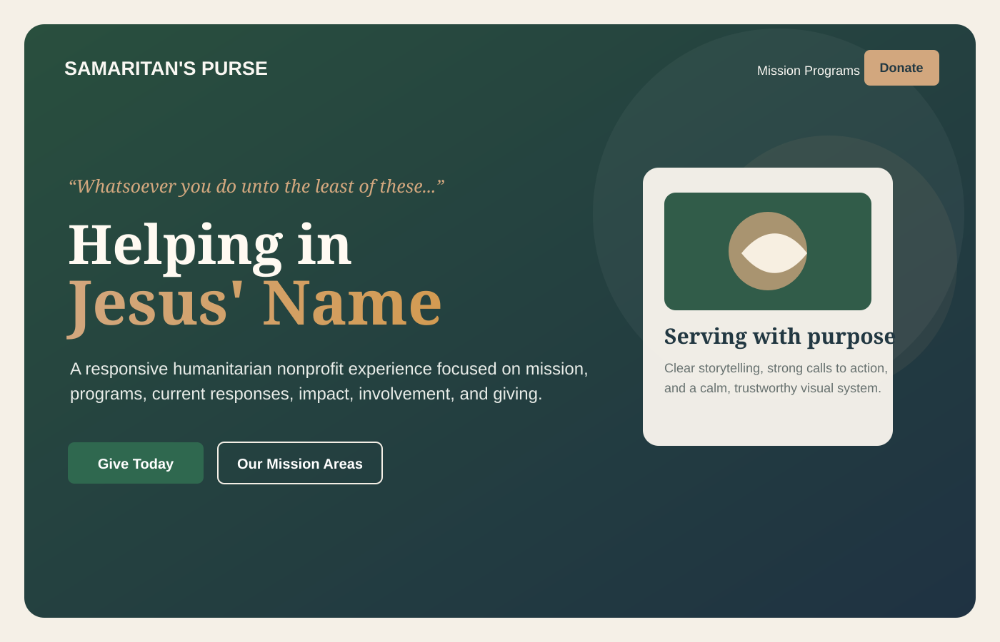
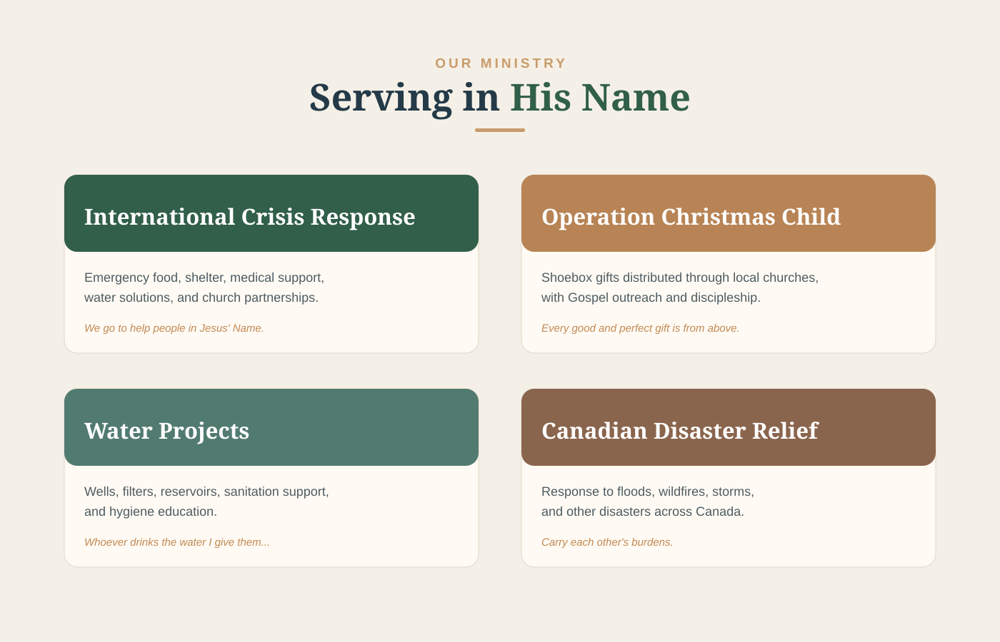
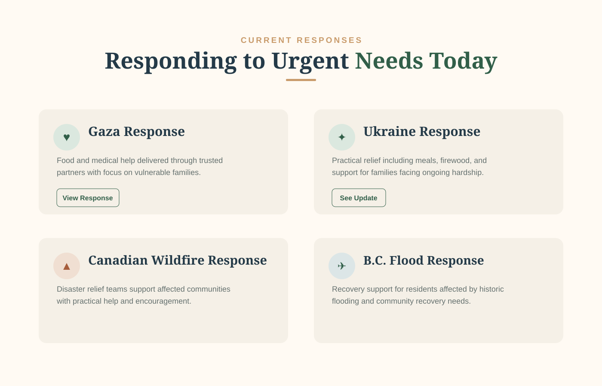
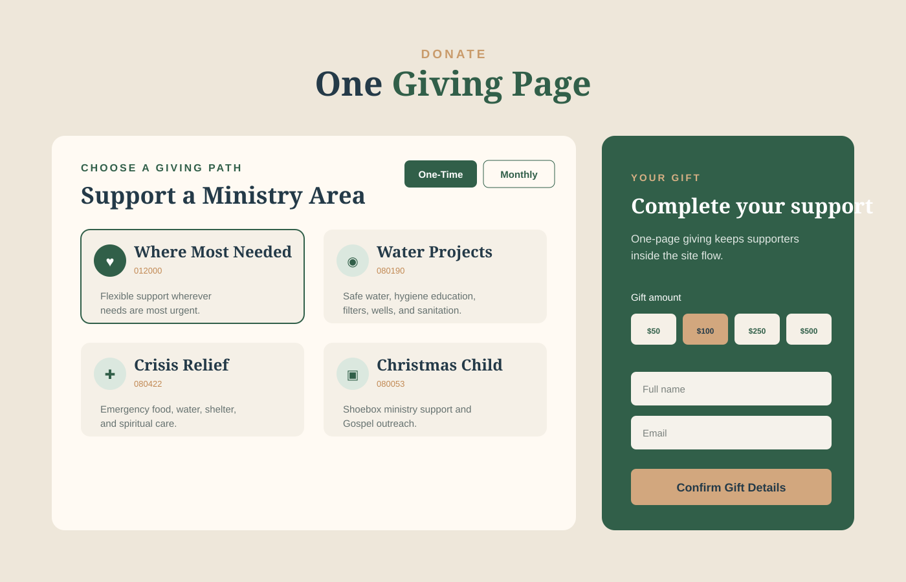

# Samaritan's Purse Website Redesign

**A responsive React + TypeScript nonprofit website concept focused on humanitarian storytelling, ministry discovery, supporter engagement, and a streamlined one-page giving experience.**

This portfolio project explores how a content-heavy humanitarian organization can present urgent-response information, ministry programs, impact, involvement opportunities, accountability, and giving options in a cohesive modern interface.

**[View the live site on GitHub Pages](https://kyla-zeit.github.io/samaritans-purse/)**

> **Portfolio note:** This is an independent front-end project and is not the official Samaritan's Purse website or an official product of Samaritan's Purse.

## Product preview

<p align="center">
  
  &nbsp;&nbsp;
  
</p>

<p align="center">
  <strong>Mission-led landing experience</strong> with clear calls to action and a strong visual hierarchy.<br/>
  <strong>Ministry programs</strong> presented through reusable storytelling cards and responsive grids.
</p>

<p align="center">
  
  &nbsp;&nbsp;
  
</p>

<p align="center">
  <strong>Current responses</strong> surface urgent humanitarian work with direct paths to deeper information.<br/>
  <strong>One-page giving</strong> keeps donation selection, frequency, amount, and supporter details in one continuous flow.
</p>

> The portfolio previews above are source-faithful visualizations based on the current React component structure, copy, layout, and colour system. The deployed GitHub Pages site is the interactive implementation.

## Product at a glance

| Area | Implementation |
| --- | --- |
| Frontend | React 18 + TypeScript |
| Build tooling | Vite |
| Styling | Tailwind CSS |
| UI primitives | shadcn/ui + Radix UI |
| Motion | Framer Motion |
| Routing | React Router |
| Data/query layer | TanStack React Query |
| Icons | Lucide React |
| Testing | Vitest + Playwright tooling |
| Deployment | GitHub Pages |

## Experience architecture

```text
Mission / Hero
      ↓
Ministry Story + Programs
      ↓
Current Humanitarian Responses
      ↓
Impact + Ways to Get Involved
      ↓
Ways to Give
      ↓
One-Page Donation Experience
      ↓
Accountability + Updates + Footer
```

The site is intentionally structured as a long-form narrative rather than a collection of disconnected pages. Navigation and calls to action move supporters through the organization story while keeping donation access close at hand.

## Core experience

### Mission-led hero

The landing section establishes the visual and emotional direction immediately:

- Full-viewport humanitarian hero treatment
- Mission-focused headline and supporting copy
- Gold accent typography over a green/navy image overlay
- Primary **Give Today** action
- Secondary path into ministry programs
- Framer Motion entrance animation and scroll cue

### Ministry programs

The program experience uses reusable responsive cards to organize major areas of work, including:

- International Crisis Response
- Operation Christmas Child
- Water Projects
- Canadian Disaster Relief

Each card combines imagery, ministry context, supporting copy, and a short scripture or ministry emphasis while preserving a consistent visual system across desktop and mobile layouts.

### Current humanitarian responses

The Current Responses section gives urgent work its own high-visibility content layer. The current implementation includes dedicated cards for:

- Gaza Response
- Ukraine Response
- Canadian Wildfire Response
- British Columbia Flood Response

Each response uses a focused summary and external call to action rather than burying time-sensitive information inside general program content.

### One-page donation experience

The giving flow is one of the more substantial interactive components in the project.

Supporters can:

- Toggle between one-time and monthly support
- Choose from multiple ministry funds
- Select preset gift amounts or enter a custom amount
- Review the selected ministry area
- Enter supporter details within the same page flow
- Receive inline validation and confirmation feedback

Current fund options include Where Most Needed, Water Projects, Crisis Relief, Middle East Crisis, Operation Christmas Child, The Greatest Journey, Canadian Relief Projects, and planned/stock giving.

The donation component is a **front-end demonstration**. It validates and confirms gift details in the UI but does not process real payments.

## Content system

The main page is assembled from focused reusable sections rather than one monolithic component:

```text
Navbar
HeroSection
MissionSection
ProgramsSection
AdditionalProgramsSection
CurrentResponsesSection
ImpactSection
GetInvolvedSection
WaysToGiveSection
DonateSection
AccountabilitySection
StayInTheKnowSection
ScriptureCtaSection
Footer
```

This keeps content responsibilities isolated and makes individual sections easier to maintain, reorder, or extend.

## Design system

The project uses a custom humanitarian/nonprofit visual language defined through Tailwind design tokens:

- Warm cream backgrounds
- Deep ministry green
- Navy text and overlays
- Muted gold accents
- Restrained rust/status accents
- **Crimson Text** for display typography
- **Source Sans 3** for body copy
- **Playfair Display** for accent and scripture styling
- Card and elevated shadow tokens for consistent depth
- Responsive grid layouts and generous editorial spacing

The result is intentionally calmer and more editorial than a typical product dashboard, because the primary job here is storytelling and supporter trust.

## Responsive behaviour

The layout is designed for mobile, tablet, and desktop use with:

- Fluid typography and spacing
- Responsive card grids
- Mobile-friendly calls to action
- Stacked donation controls on smaller screens
- Reusable container widths
- Touch-friendly buttons and navigation

## Tech stack

### Application

- React 18
- TypeScript
- Vite
- React Router
- TanStack React Query
- Tailwind CSS
- shadcn/ui / Radix UI
- Framer Motion
- Lucide React
- Sonner / toast UI

### Quality and tooling

- ESLint
- Vitest
- Playwright tooling
- GitHub Actions
- GitHub Pages

## Run locally

```bash
npm install
npm run dev
```

Vite will print the local development URL in the terminal.

### Other useful commands

```bash
npm run build
npm run lint
npm test
npm run preview
```

## Deployment

The production build is deployed through GitHub Pages:

**https://kyla-zeit.github.io/samaritans-purse/**

The application configures React Router with the `/samaritans-purse` basename so client routing works from the project Pages path.

## Project structure

```text
samaritans-purse/
├── .github/
│   └── workflows/          # GitHub Pages deployment
├── docs/
│   └── assets/             # README portfolio previews
├── public/                 # static public assets
├── src/
│   ├── assets/             # humanitarian imagery
│   ├── components/         # page sections + reusable UI
│   ├── hooks/              # shared React hooks
│   ├── lib/                # application utilities
│   ├── pages/              # route-level pages
│   ├── test/               # test setup / coverage
│   ├── App.tsx
│   ├── index.css
│   └── main.tsx
├── playwright.config.ts
├── tailwind.config.ts
├── vite.config.ts
└── package.json
```

## Scope

This is a **portfolio-scale front-end redesign/concept**, not an official Samaritan's Purse application. It demonstrates responsive content architecture, reusable React composition, nonprofit-oriented UX, interactive giving UI, animation, and static deployment.

The donation experience does not connect to a payment processor, and external humanitarian-response links intentionally lead to official Samaritan's Purse resources rather than reproducing those systems inside the project.